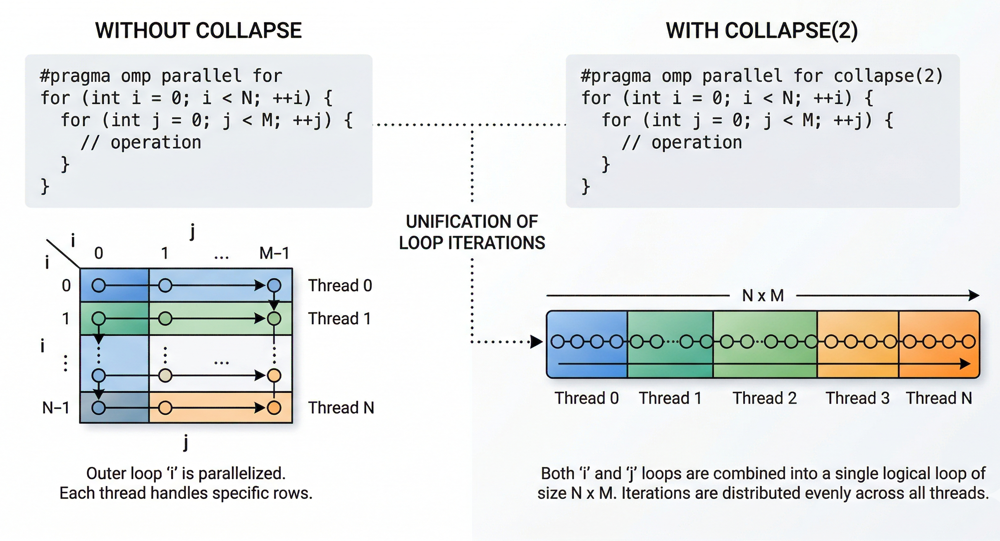

```{r echo=F, message=F, warning=F}
library(tidyverse)
library(dplyr)
library(knitr)
# library(patchwork)

theme_set(theme_minimal())

theme_update(
  plot.title = element_text(face = "bold", hjust = 0.5),
  legend.position = "bottom"
)
```



# Introduzione 

L'obbiettivo del progetto e' quello di esplorare l'ottimizzazione, per il tempo di esecuzione, di un programma sequenziale attraverso l'utilizzo delle direttive di OpenMP cercando di dimostrare la sublinearita' del programma parallelizzato.
In genere il calcolo di frattali si prestano molto bene alla parallelizzazione dato che sono una serie molto lunga di calcoli indipendenti fra di loro e generalmente anche costosi a livello computazionale.

In particolare verranno usati i frattali di Lyapunov che e' una rappresentazione visiva della stabilita' di sistemi dinamici non lineari, la cui generazione richiede il calcolo dell'esponente di Lyapunvo per ogniuna delle coordinate all'interno della griglia bidimensionale usata per la rappresentazione del frattale.


# Frattali

Un frattale e', intuitivamente, una figura in cui un singolo motivo viene ripetuto su scale descrescenti. 
Come si può vedere osservando la curva di Von Koch: 

{width=2in}

Si considera frattale un insieme che goda di tutte o molte delle seguenti proprietà:

- **Autosimilarita'**: il frattale e' unione di copie di se stesso a scale differenti
- **Struttura simile**: il frattale rileva dettagli ad ogni ingrandimento 
- **Irregolarita'**: il frattale non puo' essere descritto come luogo dei punti che soddisfano semplici condizioni geometriche o analitiche
- **Dimensione non intera**: sebbene un frattale possa essere rappresentato in uno spazio convenzionale a due o tre dimensioni


## Frattalli di Lyapunov

In matematica i frattali di Lyaounov sono frattali biforcativi derivati da un'estensione della mappa logistica in cui il grado di crescita della popolazione, $r$, commuta periodicamente tra due valori $A$ e $B$.

Un frattale di Lyapunov e' costruito tramite la mappatura delle regioni di stabilita' e chaos, calcolati tramite l'esponente di Lyapunov $\lambda$, le zone gialle corrispondono a $\lambda < 0$ (stabilita') e quelle blu corrispondono a $\lambda < 0$ (chaos).


{width="2in"}
{width="2in"}
{width="2in"}


## Algoritmo

1. Scegli una stringa di A e B di qualsiasi lunghezza
2. Costruisci la sequenza $S$ formata dalla stringa prima definita, ripetuta quante volte serva
3. Scegli un punto $(a,b) \in [0,4] \times [0,4]$ 
4. Definisci la funzione $r_n = a$ se $S_n = A$, e $r_n = b$ se $S_n = B$
5. Partendo da $x_0 = 0.5$ calcola le iterazioni $x_{n+1} = r_n x_n (1-x_n)$
6. Calcola l'esponente di Lyapunov tramite la formula:
$$
\lambda = \lim_{N \rightarrow \infty} \frac{1}{N} \sum_{n=1}^{N} \log \left| \frac{d x_{n+1}}{d x_n} \right| = \lim_{N \rightarrow \infty} \frac{1}{N} \sum_{n=1}^{N} \log \left| r_n (1-2x_n) \right|
$$
7. Colora il punto $(a,b)$ in base al risultato di $\lambda$
8. Ripeti step (3-7) per ogni punto dell'immagine


```{r echo=F, message=F, warning=F}
# 1. Lettura e combinazione dei 6 dataset
df_collapse <- read_csv("data/benchmark_results_collapse.csv") %>% mutate(Schedule = "Collapse")
df_dynamic  <- read_csv("data/benchmark_results_dynamic.csv")  %>% mutate(Schedule = "Dynamic")
df_guided   <- read_csv("data/benchmark_results_guided.csv")   %>% mutate(Schedule = "Guided")
df_parallel <- read_csv("data/benchmark_results_parallel.csv") %>% mutate(Schedule = "Parallel")
df_serial   <- read_csv("data/benchmark_results_serial.csv")   %>% mutate(Schedule = "Serial")
df_static   <- read_csv("data/benchmark_results_static.csv")   %>% mutate(Schedule = "Static")

# Uniamo tutto in un unico dataframe
df_parallel_bind <- bind_rows(df_serial, df_parallel)

# 2. Calcolo Statistico: Media, Deviazione Standard, Errore Standard e Intervallo al 95%
df_parallel_stats <- df_parallel %>%
  group_by(Test_Name, Threads, Schedule) %>%
  summarise(
    n = n(),                           # Numero di campioni (iterazioni)
    mean_time = mean(Time_ms),         # Media aritmetica
    sd_time = sd(Time_ms),             # Deviazione Standard
    .groups = 'drop'
  ) %>%
  mutate(
    # L'Errore Standard (SE) = deviazione_standard / radice_quadrata(n)
    se_time = sd_time / sqrt(n),
    
    # Moltiplicatore T di Student per il 95% di confidenza (circa 1.96 per n grandi)
    t_score = qt(0.975, df = n - 1),
    
    # Margine di Errore
    ci_margin = t_score * se_time,
    
    # Calcolo estremo inferiore e superiore della barra
    ci_lower = mean_time - ci_margin,
    ci_upper = mean_time + ci_margin
  )

df_collapse_stats <- df_collapse %>%
  group_by(Test_Name, Threads, Schedule) %>%
  summarise(
    n = n(),                           
    mean_time = mean(Time_ms),         
    sd_time = sd(Time_ms),             
    .groups = 'drop'
  ) %>%
  mutate(
    se_time = sd_time / sqrt(n),           
    t_score = qt(0.975, df = n - 1),       
    ci_margin = t_score * se_time,         
    ci_lower = mean_time - ci_margin,      
    ci_upper = mean_time + ci_margin       
  )


df_schedule_stats <- bind_rows(df_dynamic, df_guided, df_static) %>%
  group_by(Test_Name, Threads, Schedule) %>%
  summarise(
    n = n(),                           
    mean_time = mean(Time_ms),         
    sd_time = sd(Time_ms),             
    .groups = 'drop'
  ) %>%
  mutate(
    se_time = sd_time / sqrt(n),           # Errore Standard
    t_score = qt(0.975, df = n - 1),       # T-value per confidenza al 95%
    ci_margin = t_score * se_time,         # Margine di errore
    ci_lower = mean_time - ci_margin,      # Estremo inferiore della barra
    ci_upper = mean_time + ci_margin       # Estremo superiore della barra
  )
```

# OpenMP 

```{r echo=F, message=F, warning=F}

```

i tipi di schedule non cambiano significamente il risultato dei test essendo che nel codice non ci sono condizioni di uscita preliminari quindi il programma fa fare alla cpu sempre lo stesso numero di calcoli indipendentemente dalle condizioni quindi ogni computazione richiede piu' o meno lo stesso tempo e cosi' la differenza fra tipi di schedule non e' tanta

```{r echo=F, message=F, warning=F}
#| CPU: intel i7 1165G7
# 3. Creazione del grafico con Barre di Confidenza
ggplot(df_parallel_stats, aes(x = Threads, y = mean_time, color = Schedule, group = Schedule)) +
  # Aggiunta delle linee e dei punti
  geom_line(size = 1) +
  geom_point(size = 2.5) +
  
  # Aggiunta delle barre di errore (Incertezza/Intervallo di Confidenza)
  # width controlla la larghezza delle stanghette orizzontali sulla barra
  geom_errorbar(aes(ymin = ci_lower, ymax = ci_upper), width = 0.2, size = 0.8) +
  
  # Etichette e Stile
  labs(
    title = "Tempo di Esecuzione per Tipo di Schedule",
    subtitle = "Le barre rappresentano l'Intervallo di Confidenza al 95%",
    x = "Numero di Thread",
    y = "Tempo Medio di Esecuzione (ms)",
    color = "Scheduling"
  ) + 
  scale_x_continuous(breaks = unique(df_parallel_stats$Threads)) +
  theme_minimal() +
  theme(
    plot.title = element_text(hjust = 0.5, face = "bold", size = 14),
    plot.subtitle = element_text(hjust = 0.5, size = 11, color = "gray30"),
    legend.position = "bottom"
  )

df_filtered <- bind_rows(df_dynamic, df_guided, df_static)

# 3. Calcolo di Medie e Intervalli di Confidenza al 95%
df_stats <- df_filtered %>%
  group_by(Test_Name, Threads, Schedule) %>%
  summarise(
    n = n(),                           
    mean_time = mean(Time_ms),         
    sd_time = sd(Time_ms),             
    .groups = 'drop'
  ) %>%
  mutate(
    se_time = sd_time / sqrt(n),           # Errore Standard
    t_score = qt(0.975, df = n - 1),       # T-value per confidenza al 95%
    ci_margin = t_score * se_time,         # Margine di errore
    ci_lower = mean_time - ci_margin,      # Estremo inferiore della barra
    ci_upper = mean_time + ci_margin       # Estremo superiore della barra
  )
```

## Ottimizzazioni 

### Collapse

Supponiamo ad esempio di dover fare una operazione su di ogni punto all'interno di una griglia bidimensionale, naturamente nel programma ci troveremo un una situazione del genere:


```{c++}
#pragma omp parallel for
for (int y = 0; y < height; y++) {
  for (int x = 0; x < width; x++) {
    ...
  }
}
```

dove abbiamo un ciclo all'interno dell'altro.
Per parallelizzare questo codice possiamo aggiungere il comando `#pragma omp parallel for` della direttiva di `OpenMP` come mostrato nel blocco sopra ci permette di parallelizzare il ciclo for, solo pero' quello esterno questo significa che nel caso in esempio ad ogni thread viene assegnata una intera riga della griglia.

All'interno della direttiva esiste il comando di `collapse(N)` che permette di parallelizzare gli `N` cicli for.

```{c++}
#pragma omp parallel for collapse(2)
```

Graficamente come mostrato nell'immagine:



Svolgendo dei test usando come processore `Intel i7 1165G7` otteniamo:

```{r echo=F, message=F, warning=F}
#| CPU: intel i7 1165G7
bind_rows(df_parallel_stats, df_collapse_stats)  %>% 
  ggplot(aes(x=Threads, y=mean_time, color=Schedule, group=Schedule)) +
  geom_line(size=1) +
  geom_point(size=2.5) +
  geom_errorbar(aes(ymin=ci_lower, ymax=ci_upper), width=0.2, size=0.8) +
  labs(
    title="Tempo di Esecuzione con o senza direttiva Collapse",
    x = "Numero di Thread",
    y = "Tempo Medio di Esecuzione (ms)",
    color = "Direttiva"
  )

```

Nel caso specifico dei `frattali di Lyapunov` questo comando di `Colapse` non porta a prestazioni migliori.

### Scheduling

I tipi di chedule sono:

- `Static`: le operazioni sono divise in blocci chiamati `chunk` ed assegnate ad ogni thread in modo fisso all'inizio dell'esecuzione.
- `Dynamic`: le operazione sono divise anchesse in `chunk` solo che quando un thread finisce il chunk gliene viene assegnato uno nuvo.
- `Guided`: simile a `Dynamic` ma i `chunk` diminuiscono di dimensione con il proseguimento del programma.


```{r echo=F, message=F, warning=F}
#| CPU: intel i7 1165G7
ggplot(df_schedule_stats, aes(x = Threads, y = mean_time, color = Schedule, group = Schedule)) +
  # Disegna le linee e i punti
  geom_line(size = 1.2) +
  geom_point(size = 3) +
  
  # Aggiunge le barre di confidenza al 95%
  geom_errorbar(aes(ymin = ci_lower, ymax = ci_upper), width = 0.2, size = 1) +
  
  # Se i tuoi file contengono test multipli, scommenta la riga seguente per separarli:
  # facet_wrap(~ Test_Name, scales = "free_y") +
  
  # Aggiunta di etichette, titoli e miglioramenti visivi
  labs(
    title = "Confronto tra Static, Dynamic e Guided",
    subtitle = "Tempi di esecuzione medi con intervalli di confidenza (95%)",
    x = "Numero di Thread",
    y = "Tempo Medio di Esecuzione (ms)",
    color = "Tipo di Schedule"
  ) +
  # Forza l'asse X a mostrare numeri interi per i thread
  scale_x_continuous(breaks = unique(df_stats$Threads)) +
  theme_minimal() +
  theme(
    plot.title = element_text(hjust = 0.5, face = "bold", size = 14),
    plot.subtitle = element_text(hjust = 0.5, size = 11, color = "gray30"),
    legend.position = "bottom",
    legend.title = element_text(face = "bold"),
  )
```

Dal grafico si puo' vedere che il tipo di schedule piu' veloce sia `static`, almeno per numero di thread bassi, invece con l'aumentare del numero di thread non possiamo identificare uno `schedule` piu' veloce visto che le barre di confidenza si sovrappongono fra di loro.

#### Chunk size

```{r echo=F, message=F, warning=F}
df_chunk <- read_csv("data/benchmark_results_chunk_size.csv") %>% 
  mutate(
    Chunk_Size = as.numeric(str_extract(Test_Name, "\\d+"))
  )

df_chunk_stats <- df_chunk %>%
  group_by(Test_Name, Threads, Chunk_Size) %>%
  summarise(
    n = n(),                           
    mean_time = mean(Time_ms),         
    sd_time = sd(Time_ms),             
    .groups = 'drop'
  ) %>%
  mutate(
    se_time = sd_time / sqrt(n),           
    t_score = qt(0.975, df = n - 1),       
    ci_margin = t_score * se_time,         
    ci_lower = mean_time - ci_margin,      # Estremo inferiore della barra
    ci_upper = mean_time + ci_margin
  )

df_chunk_stats %>%
  ggplot(aes(x = Chunk_Size, y = mean_time)) +
  geom_line(size = 1.2) +
  geom_point(size = 3) +
  geom_errorbar(aes(ymin = ci_lower, ymax = ci_upper), width = 0.2, size = 0.8) +
  scale_x_continuous(transform = "log2") +   
  labs(
    title = "Impatto del Chunk Size sulle Prestazioni",
    subtitle = "Ricerca del bilanciamento ottimale per il partizionamento del lavoro",
    x = "Dimensione del Chunk (elementi per thread)",
    y = "Tempo Medio di Esecuzione (ms)"
  )
```

## Sublinearita'


```{r echo=F, message=F, warning=F}

```


i tipi di schedule non cambiano significamente il risultato dei test essendo che nel codice non ci sono condizioni di uscita preliminari quindi il programma fa fare alla cpu sempre lo stesso numero di calcoli indipendentemente dalle condizioni quindi ogni computazione richiede piu' o meno lo stesso tempo e cosi' la differenza fra tipi di schedule non e' tanta


# Cuda 


```{r echo=F, message=F, warning=F}
df_cuda <- read_csv("data/benchmark_results_3060.csv") %>% mutate(GPU = "3060")

df_cuda_stats <- df_cuda %>%
  group_by(Iterations, GPU) %>%
  summarise(
    n = n(),                           
    mean_time = mean(Time_CUDA_ms),         
    sd_time = sd(Time_CUDA_ms),             
    .groups = 'drop'
  ) %>%
  mutate(
    se_time = sd_time / sqrt(n),           
    t_score = qt(0.975, df = n - 1),       
    ci_margin = t_score * se_time,         
    ci_lower = mean_time - ci_margin,      
    ci_upper = mean_time + ci_margin       
  )
```


```{r echo=F, message=F, warning=F}
df_cuda_stats %>%
  ggplot(aes(x = Iterations, y = mean_time, color = GPU, group = GPU)) +
  geom_line(size = 1) +
  geom_point(size = 2.5) +
  geom_errorbar(aes(ymin = ci_lower, ymax = ci_upper), width = 0.2, size = 0.8) +
  labs(
    title = "Tempo di Esecuzione per GPU",
    x = "Iterazioni",
    y = "Tempo Medio di Esecuzione (ms)",
    color = "GPU"
  )

```


```{r echo=F, message=F, warning=F}
df_cuda_stats %>%
  # Calcoliamo il tempo (e i limiti di confidenza) per singola iterazione
  mutate(
    mean_time_per_iter = mean_time / Iterations,
    ci_lower_iter = ci_lower / Iterations,
    ci_upper_iter = ci_upper / Iterations
  ) %>%
  ggplot(aes(x = Iterations, y = mean_time_per_iter, color = GPU, group = GPU)) +
  geom_line(linewidth = 1) + 
  geom_point(size = 2.5) +
  geom_errorbar(aes(ymin = ci_lower_iter, ymax = ci_upper_iter), width = 0.2, linewidth = 0.8) +
  labs(
    title = "Tempo Medio per Singola Iterazione",
    subtitle = "Ricerca di overhead iniziale o thermal throttling",
    x = "Numero totale di Iterazioni",
    y = "Tempo per singola iterazione (ms)",
    color = "GPU"
  )
```

```{r echo=F, message=F, warning=F}
df_cuda_stats %>%
  ggplot(aes(x = Iterations, y = mean_time, color = GPU, group = GPU)) +
  geom_line(linewidth = 1) + 
  geom_point(size = 2.5) +
  geom_errorbar(aes(ymin = ci_lower, ymax = ci_upper), width = 0.2, linewidth = 0.8) +
  scale_x_continuous(transform = "log2") + 
  scale_y_continuous(transform = "log2") +
  labs(
    title = "Tempo Medio per Singola Iterazione",
    subtitle = "Ricerca di overhead iniziale o thermal throttling",
    x = "Numero totale di Iterazioni",
    y = "Tempo per singola iterazione (ms)",
    color = "GPU"
  )
```