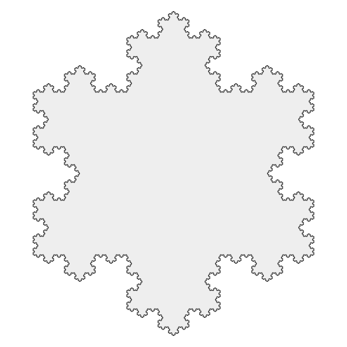
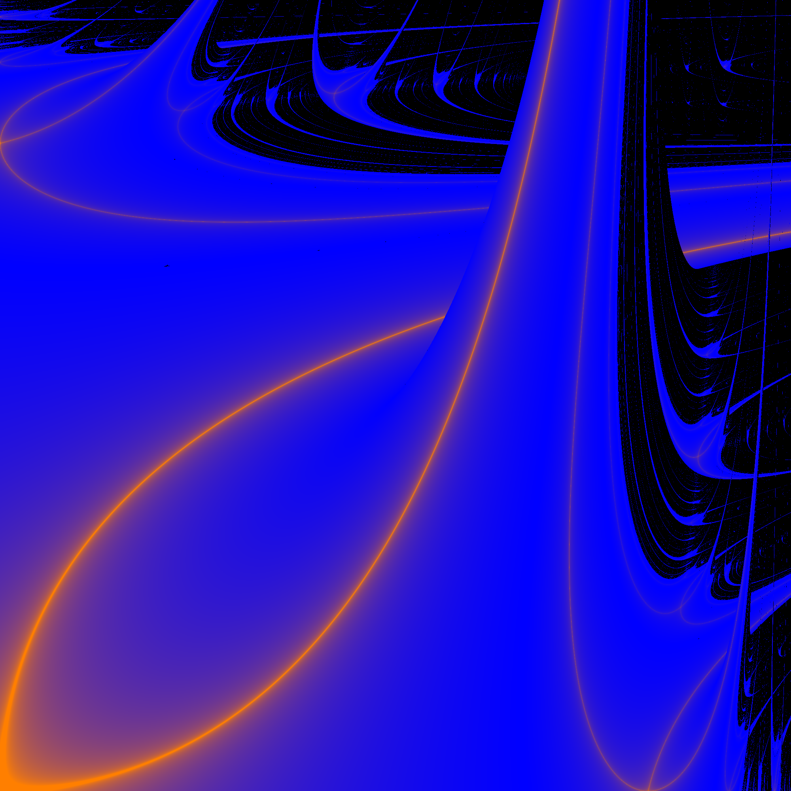
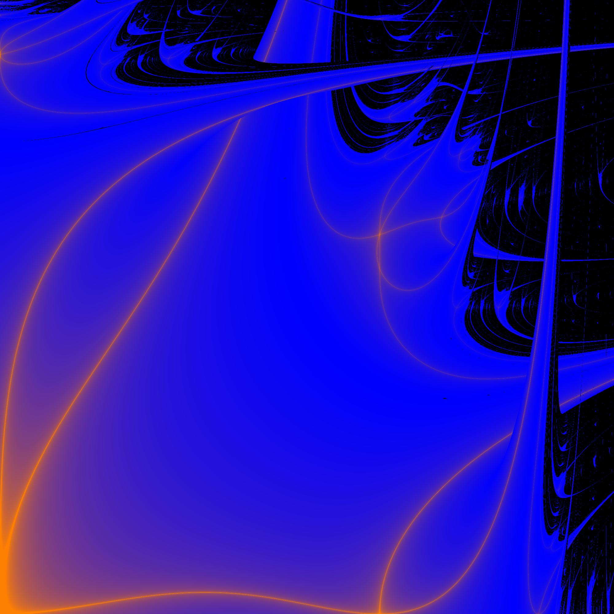
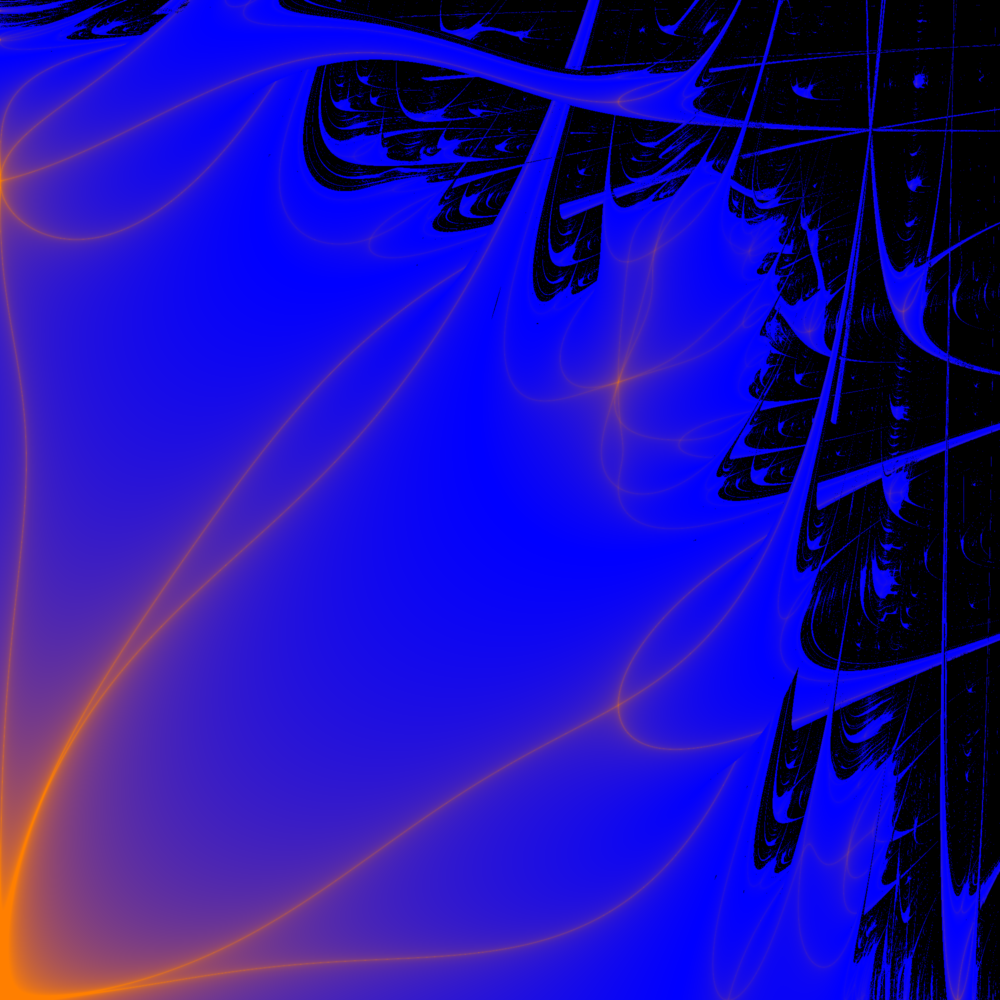

```{r echo=F, message=F, warning=F}
library(tidyverse)
library(dplyr)
library(knitr)
library(patchwork)

# Imposta il tema minimale
theme_set(theme_minimal())

# Centralizza i titoli, sottotitoli e la posizione della legenda
theme_update(
  plot.title = element_text(face = "bold", hjust = 0.5, size = 14),
  plot.subtitle = element_text(hjust = 0.5, size = 11, color = "gray30"),
  legend.position = "bottom",
  legend.title = element_text(face = "bold")
)

# Imposta le grandezze di default per tutti i grafici
update_geom_defaults("line", list(linewidth = 1.2))
update_geom_defaults("point", list(size = 3))
update_geom_defaults("errorbar", list(linewidth = 0.8, width = 0.2, width=.2))
update_geom_defaults("hline", list(linewidth = 0.8, color = "gray50", linetype = "dashed", alpha = 0.5))
update_geom_defaults("abline", list(linewidth = 0.8, color = "gray50", linetype = "dashed", alpha = 0.5))
```



# Introduzione 

L'obbiettivo del progetto e' quello di esplorare l'ottimizzazione, per il tempo di esecuzione, di un programma sequenziale attraverso l'utilizzo delle direttive di OpenMP cercando di dimostrare la sublinearita' del programma parallelizzato.
In genere il calcolo di frattali si prestano molto bene alla parallelizzazione dato che sono una serie molto lunga di calcoli indipendenti fra di loro e generalmente anche costosi a livello computazionale.

In particolare verranno usati i frattali di Lyapunov che e' una rappresentazione visiva della stabilita' di sistemi dinamici non lineari, la cui generazione richiede il calcolo dell'esponente di Lyapunvo per ogniuna delle coordinate all'interno della griglia bidimensionale usata per la rappresentazione del frattale.


# Frattali

Un frattale e', intuitivamente, una figura in cui un singolo motivo viene ripetuto su scale descrescenti. 
Come si può vedere osservando la curva di Von Koch: 

{width=2in}

Si considera frattale un insieme che goda di tutte o molte delle seguenti proprietà:

- **Autosimilarita'**: il frattale e' unione di copie di se stesso a scale differenti
- **Struttura simile**: il frattale rileva dettagli ad ogni ingrandimento 
- **Irregolarita'**: il frattale non puo' essere descritto come luogo dei punti che soddisfano semplici condizioni geometriche o analitiche
- **Dimensione non intera**: sebbene un frattale possa essere rappresentato in uno spazio convenzionale a due o tre dimensioni


## Frattalli di Lyapunov

In matematica i frattali di Lyaounov sono frattali biforcativi derivati da un'estensione della mappa logistica in cui il grado di crescita della popolazione, $r$, commuta periodicamente tra due valori $A$ e $B$.

Un frattale di Lyapunov e' costruito tramite la mappatura delle regioni di stabilita' e chaos, calcolati tramite l'esponente di Lyapunov $\lambda$, le zone blu corrispondono a $\lambda < 0$ (stabilita') e quelle nere corrispondono a $\lambda < 0$ (chaos).

::: {#fig-labeled layout-ncol=3 fig-pos="H"}

{#fig-ab width="2in"}

{#fig-aab width="2in"}

{#fig-aabab width="2in"}

Influenza della Sequenza sul frattale generato
:::

## Algoritmo

1. Scegli una stringa di A e B di qualsiasi lunghezza
2. Costruisci la sequenza $S$ formata dalla stringa prima definita, ripetuta quante volte serva
3. Scegli un punto $(a,b) \in [0,4] \times [0,4]$ 
4. Definisci la funzione $r_n = a$ se $S_n = A$, e $r_n = b$ se $S_n = B$
5. Partendo da $x_0 = 0.5$ calcola le iterazioni $x_{n+1} = r_n x_n (1-x_n)$
6. Calcola l'esponente di Lyapunov tramite la formula:
$$
\lambda = \lim_{N \rightarrow \infty} \frac{1}{N} \sum_{n=1}^{N} \log \left| \frac{d x_{n+1}}{d x_n} \right| = \lim_{N \rightarrow \infty} \frac{1}{N} \sum_{n=1}^{N} \log \left| r_n (1-2x_n) \right|
$$
7. Colora il punto $(a,b)$ in base al risultato di $\lambda$
8. Ripeti step (3-7) per ogni punto dell'immagine




# OpenMP 

In genere quando si comepra una CPU una delle caratteristiche prese in considerazione e' il numero di **Cores** o **Threads** perche' un maggiore numero permette di fare piu' cose.

La generazione dei frattali, con particolare riferimento a quelli di Lyapunov, costituisce un esempio ideale per l'applicazione di tecniche di calcolo parallelo. 
Questo deriva dal fatto che l'algoritmo può essere scomposto in una serie estremamente densa di calcoli indipendenti tra loro e caratterizzati da un alto costo computazionale.

Nello specifico, la generazione del frattale richiede di determinare l'esponente di Lyapunov per ogni singola coordinata all'interno di una griglia bidimensionale. 
Questo processo presenta diverse caratteristiche che favoriscono l'ottimizzazione tramite **OpenMP**.

## Metodologia di test

### CPU

Per i test che verranno fatti la CPU usata di default e' **Intel i7 1165G7**, in alcuni casi sono state usate altre CPU ma in quel caso verra' sempre specificato.

Alcune caratteristche delle CPU usate sono:

Name | Model | Cores | Threads | Base CK | Turbo CK | Cache 
---: | :---: | :---: | :---: | :---: | :---: | :---: | :---
Intel i7 | 1165G7 | 4 | 8 | 2.8 GHz | 4.7 GHz | 12 MB
Intel i7 | 7600HQ | 4 | 8 | 2.6 GHz | 3.5 GHz | 6 MB


### Bentchmark

Essendo abbastanza difficoltoso eseguire il programma centinaia di volte variando i parametri di test, all'interno del **Makefile** sono configurati dei comandi che permetto di di fare tutto cio' molto facilmente.

Nello specifico i comandi sono:

- **Thread_count**: tenendo costante la dimensione del problema varia la quantita' di thread in modo da riusire a calcolare lo speedup e la efficienza
- **Scale_compute**: tenendo constante il numero di threads cambia la dimensione del problema in modo da risucire a vedere come scala il tempo di esecuzione
- **Chunk_size**: tenendo constante il numero di threads e il numero di iterazioni varia la dimensione dei chunk in modo da cercare di vedere come la dimensione della cache influenza il tempo di esecuzione
- **Cache_size**: tenendo constante il numero di iterazioni vine modificata la risoluzione in modo da riuscire a vedere come la dimensionde della cache influenza il tempo di esecuzione del programma 

| Caratteristica | `thread_count` | `scale_compute` | `chunk_size` |
| :---: | :---: | :---: | :---: | :---:
| **Parametro Variabile** | Thread logici (`2, 4, 6, 8`) | Iterazioni (`500, 1000, 2000, 4000, 8000`) | Dimensione del Chunk (`1, 10, 50, 250`) |
| **Risoluzione** | Fissa: 2048x2048 | Fissa: 2048x2048 | Fissa: 2048x2048 |
| **Altri Parametri Fissi** | Iterazioni: 800, Sequenza: ABBA | Thread: invariati (`$(THREADS)`), Sequenza: ABBA | Thread: 8, Iterazioni: 2000, Sequenza: ABBA |


I bentchmark eseguono il programma 100 volte per settaggio (modificabile tramite il comando **RUNS=...**) per motivi statistici e per altri problemi che ci possono essere come il raggiungimento della **boosted clock speed** o altri fattori.


## Confronto del risultato

Prima di iniziare a studiar ele prestazioni del programma e' buna norma controllare che la versione parallela e sequenziale arrivino allo stesso risultato.
Nel caso dei frattali di Lyapunov essendo il risultato un' immagine quello che si puo' fare e' di creare uno script che confronti pixel per pixel che l'immagine sia uguale, un esempio puo' essere il seguente:

```{r message=F, warning=F}

library(pixmap)

img_serial <- read.pnm("images/serial.ppm")
img_parallel <- read.pnm("images/parallel.ppm")

# Confronto canali RGB
diff_r <- abs(img_serial@red   - img_parallel@red)
diff_g <- abs(img_serial@green - img_parallel@green)
diff_b <- abs(img_serial@blue  - img_parallel@blue)

max_error <- max(c(diff_r, diff_g, diff_b))

```

:::{#fig-labeled layout-ncol=2 fig-pos="H"}
{fig-sub1="Sequenziale"}

{fig-sub2="Parallelo"}

Immagini generato con le due versioni del programma
:::

Facendo andare lo script sulle due immafini sopra (@fig-labeled) ottenendo un errore massimo di:

```{r echo=F, message=F, warning=F}
cat("Max error: ", max_error)
# plot(img_diff, main = "Immagine di Differenza (Nera = Identiche)")
```

Come si puo' vedere dal risultato dello script le due immagini sono perfettamente identice, quindi si puo' continuare con lo studio delle prestazioni.


## Ottimizzazioni 

All'interno della direttiva di OpenMP 

### Collapse

Supponiamo ad esempio di dover fare una operazione su di ogni punto all'interno di una griglia bidimensionale, naturamente nel programma ci troveremo un una situazione del genere:

```{c++}
#pragma omp parallel for
for (int y = 0; y < height; y++) {
  for (int x = 0; x < width; x++) {
    ...
  }
}
```

dove abbiamo un ciclo all'interno dell'altro. 
Per parallelizzare questo codice possiamo aggiungere il comando **#pragma omp parallel for** della direttiva di **OpenMP** come mostrato nel blocco sopra ci permette di parallelizzare il ciclo for, solo pero' quello esterno questo significa che nel caso in esempio ad ogni thread viene assegnata una intera riga della griglia.

All'interno della direttiva esiste il comando di **collapse(N)** che permette di parallelizzare gli **N** cicli for.

```{c++}
#pragma omp parallel for collapse(2)
```

Fandeno il test con e senza collapse otteniamo:

```{r echo=F, message=F, warning=F}
df_collapse_raw <- read_csv("data/benchmark_results_collapse.csv")
df_threads_raw <- read_csv("data/benchmark_results_threads_11.csv")

# 2. Identificazione dei thread comuni ad entrambi i file
# Questo assicura che il confronto avvenga solo sugli stessi punti
common_threads <- intersect(unique(df_collapse_raw$Threads), 
                            unique(df_threads_raw$Threads))

# 3. Funzione per la pulizia dei dati e calcolo statistiche (CI 95%)
process_data <- function(df, label) {
  df %>%
    filter(Threads %in% common_threads) %>% # Filtra solo i thread comuni
    mutate(
      Type = label,
      Time_s = Time_ms / 1000
    ) %>%
    group_by(Test_Name, Threads, Type) %>%
    summarise(
      n = n(),
      mean_time = mean(Time_s),
      sd_time = sd(Time_s),
      .groups = 'drop'
    ) %>%
    mutate(
      se_time = sd_time / sqrt(n),
      t_score = qt(0.975, df = n - 1),
      ci_margin = t_score * se_time,
      ci_lower = mean_time - ci_margin,
      ci_upper = mean_time + ci_margin
    )
}

# 4. Elaborazione dei due dataframe
df_collapse_stats <- process_data(df_collapse_raw, "Con Collapse")
df_parallel_stats <- process_data(df_threads_raw, "Senza Collapse")

bind_rows(df_parallel_stats, df_collapse_stats) %>%
  ggplot(aes(x = factor(Threads), y = mean_time, color = Type, group = Type)) +
  geom_line() +
  geom_point() +
  geom_errorbar(aes(ymin = ci_lower, ymax = ci_upper)) +
  labs(
    title = "Confronto Prestazioni: Direttiva Collapse",
    subtitle = paste("Analisi su thread comuni:", paste(sort(common_threads), collapse = ", ")),
    x = "Numero di Thread",
    y = "Tempo Medio di Esecuzione (s)",
    color = "Configurazione"
  )
```

Dal grafico si vede chiaramente che con l'aumentare del nuemro di threads la versione piu' veloce e' quella senza il comando collapse all'interno della direttiva.

### Scheduling

Quando vengono creati i threads tramite la direttva il lavoro viene suddiviso in gruppi chiamati **chunk** ed il tipo di schedule decide in che modo vengono assegnati ai threds che poi dovranno svolgere il lavoro.

I tipi di scheduel all'interno della direttiva di **OpenMP** sono:

- **Static**: i chunk vengono divisi equamente fra i threads e vengono assegnati prima dell'inizio della parte parallela del programma 
- **Dynamic**: i chunk vengono divisi equamente come nello static solo che i chunk vengono assegnati manmano che i thred finiscono i chunk precendenti
- **Guided**: simile a **Dynamic** solo che la dimensione dei chunk diminuisce con l'aumentare dell'esecuzione del programma

```{r echo=F, message=F, warning=F}
#| CPU: intel i7 1165G7
df_schedule_stats <- read_csv("data/benchmark_results_schedule.csv") %>% 
  group_by(Test_Name, Threads, Schedule) %>%
  summarise(
    n = n(),                           
    mean_time = mean(Time_ms),         
    sd_time = sd(Time_ms),             
    .groups = 'drop'
  ) %>%
  mutate(
    se_time = sd_time / sqrt(n),           
    t_score = qt(0.975, df = n - 1),       
    ci_margin = t_score * se_time,         
    ci_lower = mean_time - ci_margin,      
    ci_upper = mean_time + ci_margin       
  )

ggplot(df_schedule_stats, aes(x = Threads, y = mean_time, color = Schedule, group = Schedule)) +
  geom_line() +
  geom_point() +
  geom_errorbar(aes(ymin = ci_lower, ymax = ci_upper)) +
  labs(
    title = "Confronto tra Static, Dynamic e Guided",
    subtitle = "Tempi di esecuzione medi con intervalli di confidenza (95%)",
    x = "Numero di Thread",
    y = "Tempo Medio di Esecuzione (ms)",
    color = "Tipo di Schedule"
  ) +
  scale_x_continuous(breaks = unique(df_schedule_stats$Threads))
```

Dal grafico si vede chiaramente che tuttu i tempi di esecuzione per ogni tipo di schedule si sovrappongono quindi non fa differenza il tipo di schedule, la migliore opzione sara' quella di non spcificare alcun tipo di schedule (di default e' **dynamic**) in modo da diminuire l'overehead creato dalla direttiva.

#### Chunk size

Visto che il tipo di `schedule` piu' veloce e' quello `static` un parametro che possiamo modificare e' quello del `chunk size`.
Questo parametro nel nostro caso ci permette di modificare la dimensione del lavoro che viene assegnato ad ogni thread, di default il lavoro viene diviso in parti uguali in base al numero di thread usati.

```{r echo=F, message=F, warning=F}
df_chunk <- read_csv("data/benchmark_results_chunk_size.csv") %>% 
  mutate(
    Chunk_Size = as.numeric(str_extract(Test_Name, "\\d+"))
  )

df_chunk_stats <- df_chunk %>%
  group_by(Test_Name, Threads, Chunk_Size) %>%
  summarise(
    n = n(),                           
    mean_time = mean(Time_ms),         
    sd_time = sd(Time_ms),             
    .groups = 'drop'
  ) %>%
  mutate(
    se_time = sd_time / sqrt(n),           
    t_score = qt(0.975, df = n - 1),       
    ci_margin = t_score * se_time,         
    ci_lower = mean_time - ci_margin,      # Estremo inferiore della barra
    ci_upper = mean_time + ci_margin
  )

df_chunk_stats %>%
  ggplot(aes(x = Chunk_Size, y = mean_time)) +
  geom_line() +
  geom_point() +
  geom_errorbar(aes(ymin = ci_lower, ymax = ci_upper)) +
  scale_x_continuous(transform = "log2") +   
  labs(
    title = "Impatto del Chunk Size sulle Prestazioni",
    subtitle = "Ricerca del bilanciamento ottimale per il partizionamento del lavoro",
    x = "Dimensione del Chunk (elementi per thread)",
    y = "Tempo Medio di Esecuzione (ms)"
  )
```

**...**

## Risultati

Una volta otimato il programma possiamo prendere i dati final, in particolare si possono fare due tipi di test:

- **Numero di threads**: variamo il numero di threads in modo da vedere come scala 
- **Dimensione del problema**: variamo la dimensione del problema cosi' da vedere anchesso come scala 

### Variazione del numero di threads

```{r echo=F, message=F, warning=F}
#> 

df_ryzen <- read_csv("data/benchmark_results_threads_11.csv") %>%
  mutate(
    Type = if_else(Threads == 1, "Serial", "Parallel"),
    Time_s = Time_ms / 1000
  ) %>% 
  select(-Time_ms)

df_ryzen_stats <- df_ryzen %>%
  group_by(Test_Name, Threads, Type) %>%
  summarise(
    n = n(),                           
    mean_time = mean(Time_s),         
    sd_time = sd(Time_s),             
    .groups = 'drop'
  ) %>%
  mutate(
    se_time = sd_time / sqrt(n),           
    t_score = qt(0.975, df = n - 1),       
    ci_margin = t_score * se_time,         
    ci  = mean_time - ci_margin,      
    ci_upper = mean_time + ci_margin
  )

df_ryzen_stats %>%
  ggplot(aes(x = Threads, y = mean_time, color = Type, group = Type)) +
  geom_hline(yintercept = min(df_ryzen_stats$mean_time)) + # Stile gestito dal default globale
  geom_line() +
  geom_point() +
  geom_errorbar(aes(ymin = ci, ymax = ci_upper)) +
  scale_x_continuous(breaks = df_ryzen_stats$Threads) +
  labs(
    title = "Tempo medio di esecuzione in funzione del numero di thread",
    x = "Numero di Threads",
    y = "Tempo Medio di Esecuzione (s)"
  )
```

Dal grafico possiamo vedere che il tempo di esecuzione diminuisce con l'aumentare del numero di thread fino a che non si arriva al numero di thread che ha il processore, nel caso del **Intel i7 1165G7** sono 8 threads, per poi scendere leggermente quando venogono inposti piu' threads di quelli dle processore.


#### Speedup ed Efficienza 

Usando i dati ottenuti dal test mostrato sopra ci sono due metriche che possiamo calcolare:

- **Speedup**:
$$
 Spu = \frac{T_{seq}}{T_{par}} 
$$

```{r echo=F, message=F, warning=F} 

df_summary <- df_ryzen %>%
  group_by(Threads, Type) %>%
  summarise(
    mean_time = mean(Time_s),
    .groups = 'drop'
  )

# 3. Estrazione pulita del tempo base (usando la tua colonna Type!)
T1 <- df_summary %>% 
  filter(Type == "Serial") %>% 
  pull(mean_time)

# 4. Calcolo di Speedup ed Efficienza
df_metrics <- df_summary %>%
  mutate(
    Speedup = T1 / mean_time,
    Efficiency = Speedup / Threads
  )

plot_speedup <- ggplot(df_metrics, aes(x = Threads, y = Speedup)) +
  geom_abline(intercept = 0, slope = 1) + 
  geom_line(aes(color = Type)) +
  geom_point(aes(color = Type)) +
  scale_x_continuous(breaks = df_metrics$Threads) +
  scale_y_continuous(breaks = seq(0, max(df_metrics$Threads), by = 2)) +
  labs(
    title = "Speedup in funzione del Numero di Thread",
    subtitle = "La linea tratteggiata rappresenta lo speedup ideale",
    x = "Numero di Thread",
    y = "Speedup",
    color = "Modalità"
  )

plot_efficiency <- ggplot(df_metrics, aes(x = Threads, y = Efficiency)) +
  geom_hline(yintercept = 1) +
  geom_line(aes(color = Type)) +
  geom_point(aes(color = Type)) +
  scale_x_continuous(breaks = df_metrics$Threads) +
  labs(
    title = "Efficienza Parallela",
    subtitle = "La linea tratteggiata rappresenta l'efficienza ideale (100%)",
    x = "Numero di Thread",
    y = "Efficienza",
    color = "Modalità"
  )

plot_speedup 
```

- **Efficienza**:
$$
Eff = \frac{Spu}{Threads}
$$

```{r echo=F, message=F, warning=F}
plot_efficiency
```

Dal grafico dello **speedup** si puo' vedere essenzialmente quello che si vedeva nel grafico del tempo di esecuizone in funzione del numero di thread, cioe' che il tempo di esecuzione diminuisce e di conseguenza lo speedup aumenta fino a che non si creano piu' threds di quelli che la CPU usata ha.

Il calcolo dell'efficenza dello speedup sono due faccie della stessa medaglia quindi le informazioni che si riescono a ricavare dall'uno e dall'altro sono le stesse, l'unica cosa in piu' che ha il calcolo dell'efficienza e' il fatto che essendo lo speedup constante nel caso di numero di threads maggiore di 8 l'efficienza continua a calare essendo che numeratore rimane costante e a denominatore il numero di threads aumenta sempre.

### Variaizone della dimensione del problema

```{r echo=F, message=F, warning=F}
df_scale_8 <- read_csv("data/benchmark_results_scale_8.csv") %>%
  mutate(
    Time_s = Time_ms / 1000,
    CPU = "i7 7600HQ"
  ) %>% 
  select(-Time_ms)

df_scale_11 <- read_csv("data/benchmark_results_scale_11.csv") %>%
  mutate(
    Time_s = Time_ms / 1000,
    CPU = "i7 1165G7"
  ) %>% 
  select(-Time_ms)

df_scale <- bind_rows(df_scale_11, df_scale_8)

df_scale_stats <- df_scale %>%
  group_by(Test_Name, Iterations, Threads, CPU) %>% 
  summarise(
    n = n(),                           
    mean_time = mean(Time_s),         
    sd_time = sd(Time_s),             
    .groups = 'drop'
  ) %>%
  mutate(
    se_time = sd_time / sqrt(n),           
    t_score = qt(0.975, df = n - 1),       
    ci_margin = t_score * se_time,         
    ci_lower  = mean_time - ci_margin,     # Rinominato ci in ci_lower per chiarezza
    ci_upper = mean_time + ci_margin
  )

df_scale_stats %>%
  ggplot(aes(x = Iterations, y = mean_time, color = CPU, group = CPU)) +
  geom_line() +
  geom_point() +
  geom_errorbar(aes(ymin = ci_lower, ymax = ci_upper)) +
  scale_x_continuous(breaks = df_scale_stats$Iterations) +
  labs(
    title = "Tempo di Esecuzione in funzione delle Iterazioni",
    x = "Numero di Iterazioni",
    y = "Tempo Medio di Esecuzione (s)",
    color = "CPU"
  )
```


## Cache

Essendo che la differenza di velocita' fra memoria e cache e' sostanziale quindi per un processo andare ad attingere all'interno della memoria comporta una diminuzione nelle prestazioni del processo.
Infatti la dimensione della cache e le sue prestazioni sono alcune delle caratteriestiche che i produttori di CPU che stanno migliorando (almeno lato consumer dove sono piu' comuni carichi single core) un esempio puo' essere la 3D v-cache della linea Ryzen di AMD.

Nel caso dei frattali di Lyapunov per riuscire a vedere l'effetto della dimensione della cache quello che possiamo fare e' aumetare la risoluzione dell'immagine generata in modo che sia piu' grande della cache in modo da poter vedere un rallentamento nel tempo di esecuzione.


```{r echo=F, message=F, warning=F}
df_cache_11 <- read_csv("data/benchmark_results_cache_11.csv") %>%
  mutate(
    Resolution = Width * Height,
    Op_time_ms = Time_ms / Resolution,           # Tempo in millisecondi
    Op_time_ns = Op_time_ms * 1e6,               # Tempo convertito in nanosecondi
    CPU = "i7 1165G7"
  )

df_cache_stats <- df_cache_11 %>%
  # Raggruppiamo per Height (o Resolution, se preferisci)
  group_by(Test_Name, Iterations, Threads, Height, CPU) %>% 
  summarise(
    n = n(),                           
    mean_op_time = mean(Op_time_ns),     # La nuova colonna si chiama mean_op_time    
    sd_op_time = sd(Op_time_ns),             
    .groups = 'drop'
  ) %>%
  mutate(
    se_time = sd_op_time / sqrt(n),           
    t_score = qt(0.975, df = n - 1),       
    ci_margin = t_score * se_time,         
    ci_lower  = mean_op_time - ci_margin,     
    ci_upper = mean_op_time + ci_margin
  )

df_cache_stats %>%
  # CORRETTO: usiamo y = mean_op_time invece di y = Op_time
  ggplot(aes(x = Height, y = mean_op_time, color = CPU, group = CPU)) +
  geom_line() +
  geom_point() +
  geom_errorbar(aes(ymin = ci_lower, ymax = ci_upper)) +
  scale_x_continuous(breaks = df_cache_stats$Height) +
  labs(
    title = "Tempo per singola operazione in funzione della Risoluzione", 
    x = "Altezza (Height)", # Aggiornato in base alla variabile usata
    y = "Tempo Medio per Operazione (ns)",
    color = "CPU" 
  )
```

Calcolando la dimesione delle immagini genrate alle varie risoluzioni:

| Risoluzione | Dimensione |
| :---- | ----: | 
| 512 x 512	| ~0.75 MB
| 1024 x 1024 |	~3.00 MB
| 2048 x 2048	| ~12.00 MB
| 4096 x 4096	| ~48.00 MB
| 8192 x 8192	| ~192.00 MB

possiamo vedere che c'e' un minimo nel tepo di esecuzione della singola operazione introno alla risoluzione di **1024 x 1024** che occupa all'interno della cache allincirca **~3 MB** che sta bene all'interno della cache del processore usato per i test (**12 MB**).
Una cosa interessante che si nota e' il fatto che anche se il pcessore ha **12 MB** di cache alla risoluzione di **2048 x 2048**, che occupa interamente la cache, abbiamo un aumento del tempo di esecuzione della singola operazione, questo perche' la cache non viene assegnata ad un solo processo qindi all'interno di essa possiamo travare dati generati da altri processa cosi' diminuendo la dimensione effettiva per il processo di interesse.

Un' altra metrica utilizzabile per vedere l'influenza della dimensione della cache e' il **cache miss ratio** che essenzialmente e' il numero di volte che il processo e' dovuto andare in memoria per scrivere o leggere dati.

| Risoluzione | L1-dcache-load-misses | 
| -------- | :--------: | 
| 2048 x 2048 | 2,871,163 |
| 8192 x 8192 | 8,787,204 | 

Dalla tabella si riesce a vedere chiaramente che alla risoluzione piu' alta il numero di cache miss aumenta sostanzialmente.


```{r echo=F, message=F, warning=F}
df_cache_11 <- read_csv("data/benchmark_results_cache_11.csv") %>%
  mutate(
    Resolution = Width * Height,
    Op_time_ms = Time_ms / Resolution,           # Tempo in millisecondi
    Op_time_ns = Op_time_ms * 1e6,               # Tempo convertito in nanosecondi
    CPU = "i7 1165G7"
  )

df_cache_8 <- read_csv("data/benchmark_results_cache_8.csv") %>%
  mutate(
    Resolution = Width * Height,
    Op_time_ms = Time_ms / Resolution,           # Tempo in millisecondi
    Op_time_ns = Op_time_ms * 1e6,               # Tempo convertito in nanosecondi
    CPU = "i7 7600HQ"
  )

df_cache <- bind_rows(df_cache_11, df_cache_8)

df_cache_stats <- df_cache %>%
  # Raggruppiamo per Height (o Resolution, se preferisci)
  group_by(Test_Name, Iterations, Threads, Height, CPU) %>% 
  summarise(
    n = n(),                           
    mean_op_time = mean(Op_time_ns),     # La nuova colonna si chiama mean_op_time    
    sd_op_time = sd(Op_time_ns),             
    .groups = 'drop'
  ) %>%
  mutate(
    se_time = sd_op_time / sqrt(n),           
    t_score = qt(0.975, df = n - 1),       
    ci_margin = t_score * se_time,         
    ci_lower  = mean_op_time - ci_margin,     
    ci_upper = mean_op_time + ci_margin
  )

df_cache_stats %>%
  ggplot(aes(x = Height, y = mean_op_time, color = CPU, group = CPU)) +
  geom_line() +
  geom_point() +
  geom_errorbar(aes(ymin = ci_lower, ymax = ci_upper)) +
  scale_x_continuous(breaks = df_cache_stats$Height) +
  scale_y_continuous(transform = "log10") + 
  labs(
    title = "Tempo per singola operazione in funzione della Risoluzione", 
    x = "Altezza (Height)", 
    y = "Tempo Medio per Operazione (ns) - Log10",
    color = "CPU" 
  )
```

Guardando la differenza fra le due CPU nel caso del **7600HQ** si vede che per le risoluzioni a cui l'altra CPU ha un minimo 

Confrontando le due CPU in questo test si puo' vedere come nel caso delle risoluzioni per cui il **1165G7** ha il minimo (**1024 x 1024**) per il **7600HQ** rimane quasi costante con le altre risoluzioni, questo indicando quindi che, essendo la dimensione della cache piu' piccola rispetto al **1165G7**, il processo deve andare sempre in memoria a scrivere e leggere dati, per questo piu' lento.


# Cuda 


```{r echo=F, message=F, warning=F}
df_scale_cuda <- read_csv("data/benchmark_results_3060.csv") %>%
  mutate(
    Time_s = Time_CUDA_ms / 1000,
    CPU = "3060"
  ) %>% 
  select(-Time_CUDA_ms)

df_scale <- bind_rows(df_scale_11, df_scale_8, df_scale_cuda)

df_scale_stats <- df_scale %>%
  group_by(Test_Name, Iterations, CPU) %>% 
  summarise(
    n = n(),                           
    mean_time = mean(Time_s),         
    sd_time = sd(Time_s),             
    .groups = 'drop'
  ) %>%
  mutate(
    se_time = sd_time / sqrt(n),           
    t_score = qt(0.975, df = n - 1),       
    ci_margin = t_score * se_time,         
    ci_lower  = mean_time - ci_margin,     # Rinominato ci in ci_lower per chiarezza
    ci_upper = mean_time + ci_margin
  )

df_scale_stats %>%
  ggplot(aes(x = Iterations, y = mean_time, color = CPU, group = CPU)) +
  geom_line() +
  geom_point() +
  geom_errorbar(aes(ymin = ci_lower, ymax = ci_upper)) +
  scale_x_continuous(breaks = df_scale_stats$Iterations) +
  labs(
    title = "Tempo di Esecuzione in funzione delle Iterazioni",
    x = "Numero di Iterazioni",
    y = "Tempo Medio di Esecuzione (s)",
    color = "Modalità"
  )
```


# Conlusioni 